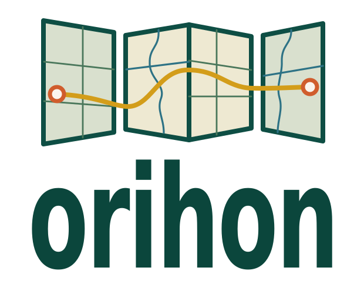

# Orihon brand assets

**ORIHON — Offers Responsive Interactions, Handles Overlays Natively.**

This expansion communicates the library's product promise: responsive map interaction and native overlay handling.

The npm package includes production SVG and PNG artwork in `assets/brand`. These files are visual assets only and do not add JavaScript to the runtime bundle.



## Package paths

| Purpose | Package path |
| --- | --- |
| Default horizontal logo | `orihon/brand/svg/orihon-logo-horizontal.svg` |
| Reversed logo for dark surfaces | `orihon/brand/svg/orihon-logo-reversed.svg` |
| Standalone folded-map mark | `orihon/brand/svg/orihon-mark.svg` |
| Favicon | `orihon/brand/svg/orihon-favicon.svg` |
| Avatar | `orihon/brand/svg/orihon-avatar.svg` |
| PNG exports | `orihon/brand/png/*` |
| CSS design tokens | `orihon/brand/tokens/orihon-tokens.css` |
| DTCG JSON tokens | `orihon/brand/tokens/orihon-tokens.json` |

With a bundler that supports asset imports, resolve the public package subpath:

```js
import logoUrl from "orihon/brand/svg/orihon-logo-horizontal.svg";
```

For a static page, copy the required asset to the application's public directory. Use the SVG variants for UI and documentation; use the supplied PNG sizes for social previews, app icons and systems that do not accept SVG.

## Color tokens

```css
@import "orihon/brand/tokens/orihon-tokens.css";

.product-header {
  color: var(--orihon-forest);
  background: var(--orihon-ivory);
}
```

Keep the artwork's aspect ratio and use the reversed logo on dark backgrounds. The supplied tokens define the forest, route ochre, terracotta, water, sage, sand and ivory palette used by the artwork.
